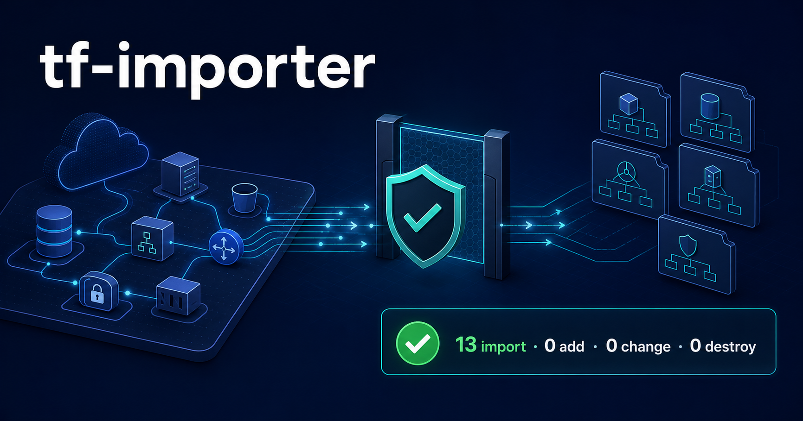

# tf-importer

[English](README.md)

**Um framework determinístico e somente de importação para adotar
infraestrutura AWS existente no Terraform.**

O `tf-importer` conecta etapas normalmente tratadas de forma isolada:
descoberta regional, validação da conta, geração de imports, normalização da
configuração, análise de dependências, modularização por categoria,
reconciliação e validação dos planos Terraform.

Ele lê a infraestrutura AWS existente e gera artefatos para sua adoção no
Terraform. Ele nunca executa `terraform apply`.

<p align="center">
  
</p>

```text
AWS existente  →  Descobrir e classificar  →  Gerar e modularizar Terraform
                                                     ↓
                          N to import, 0 to add, 0 to change, 0 to destroy
```

<p align="center">
  
</p>

A animação é fictícia e reproduzível; ela não contém dados reais de uma conta.

## Comece aqui

Escolha o caminho correspondente ao seu objetivo:

| Objetivo | Próxima leitura |
| --- | --- |
| Executar o importer pela primeira vez | [Primeiros passos](docs/GETTING_STARTED-pt.md) |
| Consultar todos os comandos suportados | [Referência de comandos](docs/COMMAND_REFERENCE-pt.md) |
| Testar em um laboratório AWS controlado | [Demo AWS sanitizado](docs/demo/DEMO_RUNBOOK.md) |
| Entender o projeto e os roots gerados | [Arquitetura](docs/ARCHITECTURE.md) |
| Avaliar versões e cobertura AWS | [Compatibilidade](docs/COMPATIBILITY.md) |
| Revisar garantias e limites da automação | [Contrato do produto](docs/PRODUCT_CONTRACT.md) |
| Contribuir com uma mudança | [Guia de contribuição](CONTRIBUTING.md) |

Para a primeira execução, a menor sequência segura é:

```bash
cp config/environments.conf.example config/environments.conf
cp config/modularization.conf.example config/modularization.conf

# Substitua todos os placeholders e confirme a conta e a região selecionadas.
make doctor ENV=dev
make pipeline ENV=dev
```

Arquivos gerados podem conter informações sensíveis da conta. Eles são
ignorados pelo Git e não devem ser publicados sem uma revisão de sanitização.

## Qual problema ele resolve

O import do Terraform é apenas uma etapa na adoção de um ambiente AWS
estabelecido. Um fluxo seguro também precisa responder:

- Quais recursos foram descobertos, excluídos, mapeados ou ficaram pendentes?
- As credenciais correspondem à conta e à região pretendidas?
- O Terraform representa a configuração observada sem propor drift?
- Todos os recursos e imports gerados chegaram ao destino?
- Cada categoria pode ser planejada sem add, change ou destroy?

O `tf-importer` transforma essas perguntas em verificações determinísticas e
relatórios reconciliados. Recursos suportados são modularizados quando existe
um contrato completo; caso contrário, recursos válidos permanecem como
Terraform nativo em vez de desaparecer.

## Contrato de segurança

- **Uma região explícita:** somente `PROJECT_REGION` é consultada.
- **Bloqueio por conta:** a conta autenticada deve corresponder ao escopo.
- **Fluxo AWS somente leitura:** descoberta e enriquecimento não alteram a AWS.
- **Aceitação somente de imports:** add, change ou destroy interrompem o fluxo.
- **Sem apply automático:** o projeto não possui entrypoint de apply.
- **Sem perda silenciosa:** todo resultado de descoberta e import é reconciliado.
- **Dados locais privados:** state, planos, inventários, valores, pacotes e
  Terraform gerado permanecem ignorados por padrão.

A definição formal de pronto está no
[Contrato de Automação do Produto](docs/PRODUCT_CONTRACT.md). Questões de
segurança devem seguir o processo privado descrito em [SECURITY.md](SECURITY.md).

## Escopo e cobertura

O `tf-importer` **não** afirma importar todos os recursos da AWS nem todas as
variantes de um tipo validado. A cobertura das APIs de descoberta e os schemas
do provider Terraform possuem limitações.

As baselines aceitas de DEV, QA e PRD cobrem 31 tipos de recurso Terraform nas
áreas de rede, containers, balanceamento, IAM e criptografia, armazenamento,
mensageria, Lambda, SSM, EventBridge, CloudWatch Logs, CloudFormation e AWS
Backup. Variantes ambíguas, históricas, padrão ou gerenciadas por serviços
podem permanecer como Terraform nativo ou ser relatadas para revisão.

A lista oficial de tipos, versões validadas, restrições do provider e a
diferença entre recursos reconhecidos e suportados de ponta a ponta estão em
[Compatibilidade](docs/COMPATIBILITY.md).

## Estrutura do repositório

```text
tf-importer/
├── config/       # Exemplos públicos de configuração e mapas de recursos
├── docs/         # Guias, arquitetura, contratos e runbooks do demo
├── examples/     # Exemplos sanitizados e reproduzíveis
├── scripts/      # Comandos CLI, runtime central, providers e pipeline
├── templates/    # Templates do destino e módulos reutilizáveis
└── tests/        # Testes offline, unitários e de integridade
```

Execuções locais criam os diretórios ignorados `work/`, `output/`, `reports/`
e `logs/`. O projeto IaC final é gravado em `DESTINATION_PROJECT_DIR` e usa
roots independentes em:

```text
terraform/<ambiente>/<categoria>/
```

Consulte [Arquitetura](docs/ARCHITECTURE.md) para entender as camadas do código,
os artefatos locais, a estrutura de destino e o layout multi-account.

## Pré-requisitos e validação

O runtime suporta Ubuntu ou Linux compatível, incluindo WSL2, com Bash 5+,
AWS CLI 2, Terraform `>= 1.5, < 2.0`, Python 3.12+, jq 1.6+, curl e utilitários
GNU. Confirme as versões exatas em [Compatibilidade](docs/COMPATIBILITY.md).

A suíte offline não autentica na AWS nem altera infraestrutura:

```bash
make test
make ci
```

Para uma avaliação offline a partir de um clone limpo, instale as ferramentas de
validação documentadas e execute `make ci` antes de adicionar qualquer
configuração ou credencial AWS. O comando executa testes unitários e de
integridade, sintaxe Bash, ShellCheck, Python, JSON, formatação Terraform,
isolamento de credenciais, auditorias de conteúdo rastreado e links Markdown,
metadados de release, smoke test de checkout limpo e whitespace do Git.

A aprovação do CI comprova o contrato estático e offline; ela não substitui uma
aceitação controlada em uma conta AWS real. A geração Terraform permanece
experimental e sensível ao provider. Interrompa imediatamente se qualquer plano
gerado contiver add, change ou destroy.

Consulte [tests/README.md](tests/README.md) para cobertura e regras de
contribuição. A preparação de release está definida no
[checklist de prontidão](docs/RELEASE_READINESS-pt.md).

## Limitações conhecidas

- A Resource Groups Tagging API não expõe todos os recursos AWS.
- Recursos sem tags podem exigir outro adaptador de descoberta.
- A geração de configuração Terraform é experimental e sensível ao provider.
- Valores SSM e pacotes Lambda são snapshots sensíveis.
- Políticas da conta podem impedir operações de leitura válidas.

Essas limitações nunca enfraquecem o gate de plano somente de importação nem
autorizam alterações automáticas na AWS. O trabalho planejado está no
[roadmap público](docs/ROADMAP.md).

## Projeto e comunidade

Criado e mantido por **Douglas Fernandes**
([@50taoDoug](https://github.com/50taoDoug)). A arquitetura, os requisitos, as
regras de segurança, os critérios de aceitação e as decisões finais de
engenharia são conduzidos por uma pessoa; assistentes de IA aceleraram partes
da implementação.

Copyright 2026 Douglas Fernandes. Licenciado sob a
[Apache License 2.0](LICENSE). Redistribuições devem preservar [NOTICE](NOTICE).
Os metadados de citação estão em [CITATION.cff](CITATION.cff), e o registro
completo de autoria está em [AUTHORS.md](AUTHORS.md).

- [Índice da documentação](docs/README-pt.md)
- [Guia de contribuição](CONTRIBUTING.md)
- [Código de Conduta](CODE_OF_CONDUCT.md)
- [Fluxo Git](docs/GIT_WORKFLOW.md)
- [Apoie a continuidade do projeto](https://github.com/sponsors/50taoDoug)

Use GitHub Issues para bugs e solicitações. Não divulgue questões de segurança
publicamente.
