# tf-importer

[Português](README-pt.md)

**A deterministic, import-only framework for adopting existing AWS
infrastructure into Terraform.**

`tf-importer` connects the stages normally handled separately: regional
discovery, account validation, import generation, configuration normalization,
dependency analysis, category modularization, reconciliation, and Terraform
plan validation.

It reads existing AWS infrastructure and generates Terraform adoption
artifacts. It never runs `terraform apply`.

```text
Existing AWS  →  Discover and classify  →  Generate and modularize Terraform
                                                    ↓
                         N to import, 0 to add, 0 to change, 0 to destroy
```

<p align="center">
  
</p>

The animation is fictional and reproducible; it contains no real account data.

## Start Here

Choose the path that matches what you need:

| Goal | Read next |
| --- | --- |
| Run the importer for the first time | [Getting Started](docs/GETTING_STARTED.md) |
| See every supported command | [Command Reference](docs/COMMAND_REFERENCE.md) |
| Test it in a controlled AWS lab | [Sanitized AWS Demo](docs/demo/DEMO_RUNBOOK.md) |
| Understand the design and generated roots | [Architecture](docs/ARCHITECTURE.md) |
| Evaluate versions and AWS coverage | [Compatibility](docs/COMPATIBILITY.md) |
| Review guarantees and automation boundaries | [Product Contract](docs/PRODUCT_CONTRACT.md) |
| Contribute a change | [Contributing Guide](CONTRIBUTING.md) |

For a first run, the shortest safe sequence is:

```bash
cp config/environments.conf.example config/environments.conf
cp config/modularization.conf.example config/modularization.conf

# Replace every placeholder, then verify the selected account and region.
make doctor ENV=dev
make pipeline ENV=dev
```

Generated files can contain sensitive account information. They are ignored by
Git and must not be published without a separate sanitization review.

## What Problem It Solves

Terraform import is only one step in adopting an established AWS environment.
A safe workflow must also answer:

- Which resources were discovered, excluded, mapped, or left unresolved?
- Are the credentials bound to the intended account and region?
- Can Terraform represent the observed configuration without proposing drift?
- Were all generated resources and imports preserved in the destination?
- Can each category be planned independently with no add, change, or destroy?

`tf-importer` turns those questions into deterministic checks and reconciled
reports. Supported resources are modularized when a complete contract exists;
otherwise valid resources remain native Terraform instead of disappearing.

## Safety Contract

- **One explicit region:** only `PROJECT_REGION` is queried.
- **Account lock:** the authenticated account must match the selected scope.
- **Read-only AWS workflow:** discovery and enrichment do not mutate AWS.
- **Import-only acceptance:** add, change, or destroy actions fail the run.
- **No automatic apply:** the project has no apply entrypoint.
- **No silent loss:** every discovery and import outcome is reconciled.
- **Private runtime data:** state, plans, inventories, values, packages, and
  generated account Terraform remain ignored by default.

The formal definition of done is in the
[Product Automation Contract](docs/PRODUCT_CONTRACT.md). Security concerns
must follow the private process in [SECURITY.md](SECURITY.md).

## Scope and Coverage

`tf-importer` does **not** claim to import every AWS resource or every variant
of a validated type. Discovery API coverage and Terraform provider schemas both
have limits.

The accepted DEV, QA, and PRD baselines cover 31 Terraform resource types
across networking, containers, load balancing, IAM and encryption, storage,
messaging, Lambda, SSM, EventBridge, CloudWatch Logs, CloudFormation, and AWS
Backup. Ambiguous, historical, default, or service-managed variants can be
preserved as native Terraform or reported for review.

The authoritative type list, validated tool versions, provider constraints,
and distinction between recognized and end-to-end supported resources are in
[Compatibility](docs/COMPATIBILITY.md).

## Repository Layout

```text
tf-importer/
├── config/       # Public configuration examples and resource maps
├── docs/         # User guides, architecture, contracts, and demo runbooks
├── examples/     # Sanitized, reproducible examples
├── scripts/      # CLI commands, runtime core, providers, and pipeline logic
├── templates/    # Destination-project templates and reusable modules
└── tests/        # Offline unit and project-integrity tests
```

Local executions create ignored `work/`, `output/`, `reports/`, and `logs/`
directories. The final IaC project is written to `DESTINATION_PROJECT_DIR` and
uses independently operated roots under:

```text
terraform/<environment>/<category>/
```

See [Architecture](docs/ARCHITECTURE.md) for source layers, runtime artifacts,
destination structure, and multi-account layout.

## Requirements and Validation

Runtime support targets Ubuntu or compatible Linux, including WSL2, with Bash
5+, AWS CLI 2, Terraform `>= 1.5, < 2.0`, Python 3.12+, jq 1.6+, curl, and GNU
utilities. Confirm exact versions in [Compatibility](docs/COMPATIBILITY.md).

The offline suite does not authenticate to AWS or modify infrastructure:

```bash
make test
make ci
```

For an offline evaluation from a clean clone, install the documented validation
tools and run `make ci` before adding any AWS configuration or credentials.
`make ci` runs unit and integrity tests plus Bash syntax, ShellCheck, Python,
JSON, Terraform formatting, credential isolation, tracked-content and Markdown
link audits, release metadata, a clean-checkout smoke test, and Git whitespace
gates.

Passing CI proves the static and offline product contract; it does not replace a
controlled real-AWS acceptance run. Terraform generation remains experimental
and provider-sensitive. Stop immediately if any generated plan contains add,
change, or destroy actions.

See [tests/README.md](tests/README.md) for test coverage and contribution rules.
Release preparation is defined in the
[release-readiness checklist](docs/RELEASE_READINESS.md).

## Known Limitations

- The Resource Groups Tagging API does not expose every AWS resource.
- Untagged resources may require an additional discovery adapter.
- Terraform configuration generation is experimental and provider-sensitive.
- SSM values and Lambda packages are sensitive point-in-time snapshots.
- Account policies may prevent otherwise valid read operations.

Limitations never weaken the import-only gate or authorize automatic AWS
changes. Planned work is tracked in the [public roadmap](docs/ROADMAP.md).

## Project and Community

Created and maintained by **Douglas Fernandes**
([@50taoDoug](https://github.com/50taoDoug)). Architecture, requirements,
safety rules, acceptance criteria, and final engineering decisions are
human-directed; AI assistants accelerated parts of the implementation.

Copyright 2026 Douglas Fernandes. Licensed under the
[Apache License 2.0](LICENSE). Redistributions must preserve [NOTICE](NOTICE).
Machine-readable citation metadata is in [CITATION.cff](CITATION.cff), and the
complete author record is in [AUTHORS.md](AUTHORS.md).

- [Documentation index](docs/README.md)
- [Contributing guide](CONTRIBUTING.md)
- [Code of Conduct](CODE_OF_CONDUCT.md)
- [Git workflow](docs/GIT_WORKFLOW.md)

Use GitHub Issues for bugs and feature requests. Do not disclose security
issues publicly.
