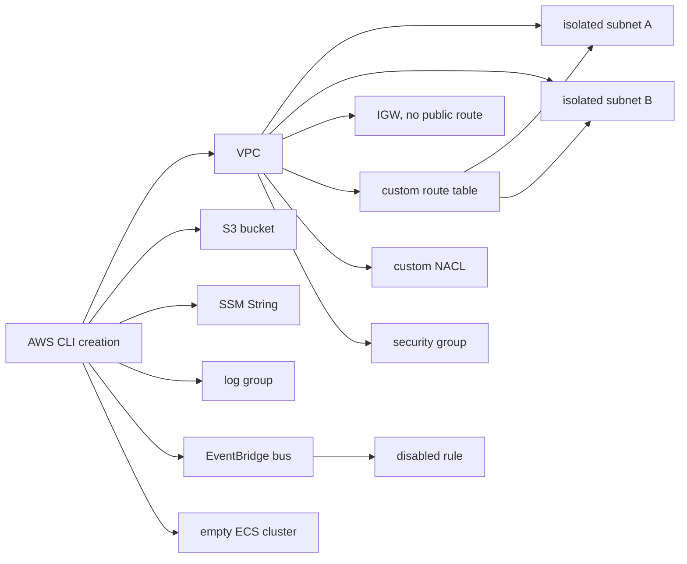

# AWS public demo architecture

## Objective and assumptions

The lab proves adoption of pre-existing AWS resources into an import-only
Terraform baseline. Resources are created by AWS CLI, then discovered, cleaned,
organized, modularized where supported, and validated by `tf-importer`. The
framework never creates, changes, or destroys AWS resources.

Use a personal or dedicated non-production account, temporary credentials with
MFA, and one explicitly selected region. Never commit the account ID. The demo
runbook defines the required temporary-credential and identity checks.

## Inventory

| Resource | Count | Design | Expected outcome |
|---|---:|---|---|
| VPC | 1 | `10.77.0.0/16` | `network`, modularized |
| Subnet | 2 | isolated, two AZs, no public IP | `network`, modularized |
| Internet gateway | 1 | attached, no default route | `network`, modularized |
| Route table | 1 | local route only, two associations | `network`, modularized |
| Network ACL | 1 | custom, no permissive entries | `network`, preserved native |
| Security group | 1 | no ingress | `network`, modularized |
| S3 bucket | 1 | empty, all public access blocked | `s3`, modularized |
| SSM parameter | 1 | `String`, harmless `demo-value` | `ssm`, modularized |
| CloudWatch log group | 1 | empty, one-day retention | `logs`, modularized |
| EventBridge event bus | 1 | no targets | `events`, preserved native |
| EventBridge rule | 1 | disabled, no targets | `events`, modularized |
| ECS cluster | 1 | no tasks or services | `ecs`, modularized |

Route-table associations are dependencies created by CLI but are not promised as
independent Resource Groups Tagging API discoveries. The custom network ACL and
event bus are mapped Terraform types without current destination module contracts,
so they demonstrate native-resource preservation.

## Cost and security

No compute, NAT gateway, load balancer, VPC endpoint, public IPv4 address, log
ingestion, or stored object is planned. Control-plane requests and minimal metadata
storage may still be billed, and pricing varies by region and account. Delete the
lab promptly and verify billing afterward. The design makes no “free” claim.

All resources carry `Project`, `Environment`, `ManagedBy`, `Purpose`, and `Owner`
tags. There are no secrets, IAM identities, public routes, public endpoints,
targets, scheduled invocations, or running workloads. The random bucket suffix is
neutral and stored only in an ignored manifest.

## Cleanup and limitations

Review `delete-demo-resources.sh` before creation. Cleanup reads exact IDs from the
ignored manifest, verifies its original account/region/prefix, rechecks the project
tag, removes service resources, then network dependencies, and never scans other
regions. It retries exact-ID and tag-based absence checks and deletes the local
manifest only when both reach zero. If creation is interrupted or verification
fails, retain the manifest and rerun cleanup after review.

The S3 bucket is intentionally empty throughout the demonstration. Do not
upload objects or create versions. Objects or versions can prevent deletion;
the cleanup script must return a clear failure and retain the manifest instead
of expanding into an unreviewed recursive deletion. The manifest-based and
tag-validated cleanup scope remains authoritative.

Discovery depends on AWS Resource Groups Tagging API coverage and propagation.
Tag visibility may lag. Provider-generated configuration can vary with provider
versions. The real import-only plan must be captured; its `N` is not predetermined.
No Lambda package snapshot, route to the internet, recurring event, or cross-account
behavior is demonstrated.
